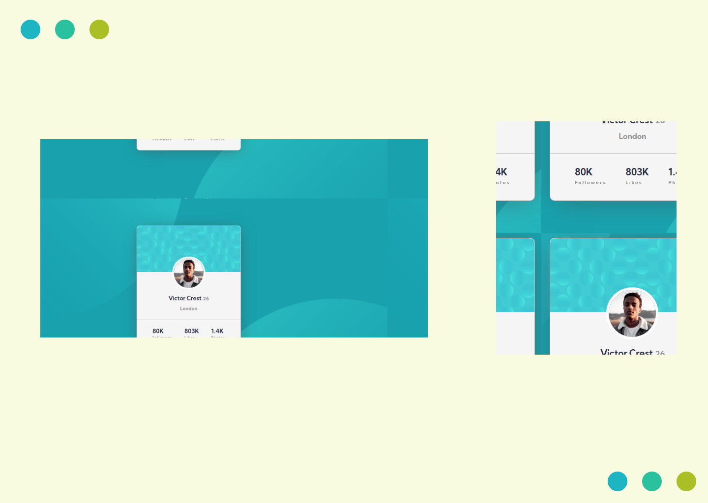

# Frontend Mentor - Profile card component solution

Essa é a solução do desafio [Profile card component challenge on Frontend Mentor](https://www.frontendmentor.io/challenges/profile-card-component-cfArpWshJ).

## Table of contents

- [Sobre o desafio](#Sobre-o-desafio)
  - [Screenshot](#screenshot)
  - [Links](#links)
  - [Tecnologias](#Tecnologias)
  - [O que eu aprendi](#O-que-eu=aprendi)
  - [Referências](#Referências)
- [Agradecimentos](#Agradecimentos)

## Sobre o desafio

- Deixar o design mais parecido possível com o design do desafio

### Screenshot

### Links

- Solução URL: [site do desafio](https://www.frontendmentor.io/solutions/profilecards-flex-box-and-mobile-first-_qLOhnV0Z)
- Site URL: [Solução  em site](https://carolinecordeiro.github.io/profile-cards-front-end-mentor//)

### Tecnologias

- HTML5 semântico
- CSS
- Flexbox

## O que eu aprendi
- Fazer layout considerando primeiro o mobile-first

### Referências

- [Dev soutinho](https://www.youtube.com/watch?v=Cu-HP-gvggg&t=471s) - posicionamentos css (imagem e o card)

## Agradecimentos
- Eu não estava conseguindo posicionar os SVG's corretamente no background e essa [solução](https://github.com/ArpadGBondor/Web_challenge_6-Frontend_Mentor-Profile_card_component) me ajudou 